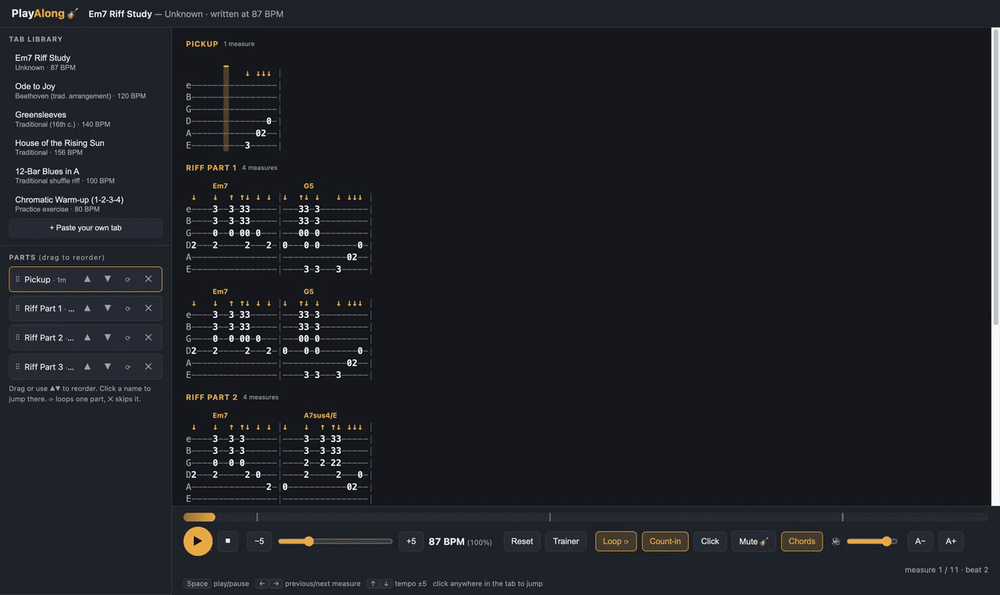
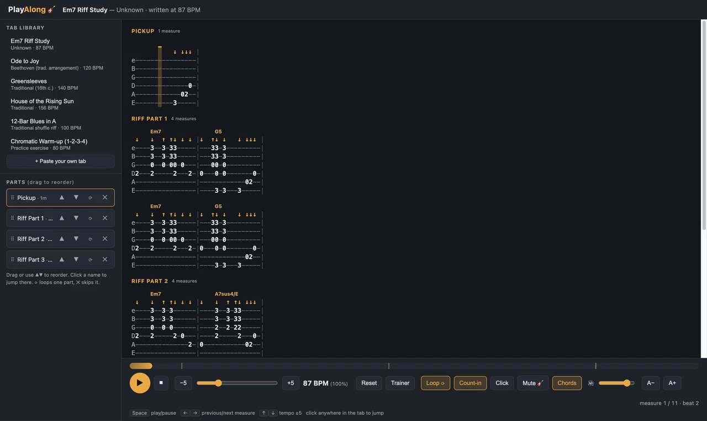
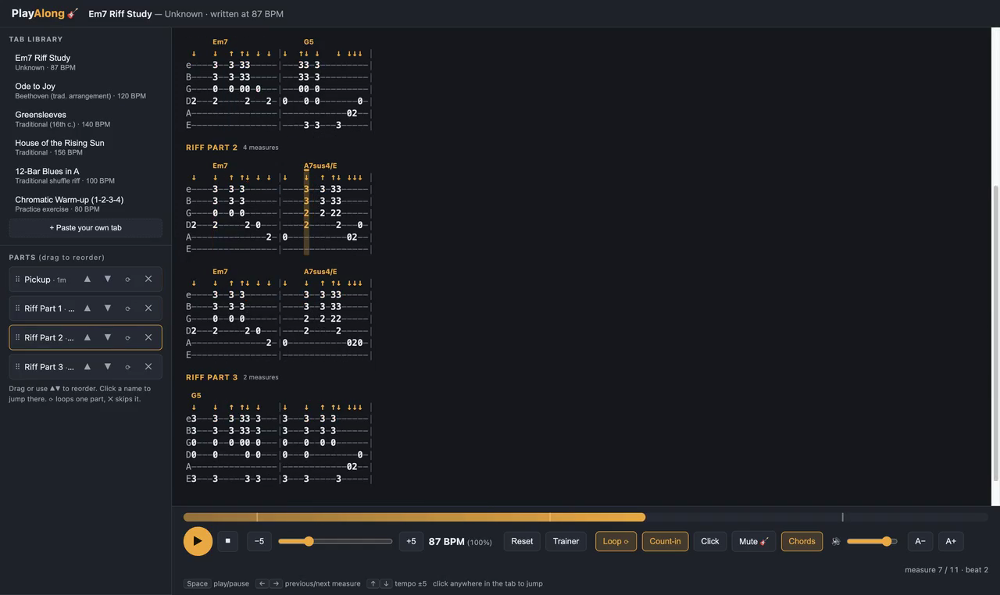

# PlayAlong 🎸

A zero-dependency guitar tab player. Paste or load standard ASCII guitar tabs and it
plays them with a synthesized plucked-string sound, a moving focus bar over the tab,
adjustable tempo, and reorderable song parts.

## Demo

Chord detection on Pink Floyd's *Wish You Were Here* riff — `Em7 · G5 · A7sus4` labelled
above the tab as the playhead moves through each chord:



<sub>(Same clip as a higher-quality [MP4](docs/chord-detection-demo.mp4).)</sub>

### Screenshots

The whole riff, every detected chord above the staff:



The focus bar crossing the `A7sus4/E` change in Riff Part 2:



## Run it

```sh
cd playalong
python3 -m http.server 8765
# open http://localhost:8765
```

(The HTTP server is only needed so the app can read tabs from the `tabs/` folder;
everything else is a single static `index.html`.)

## Features

- **Playback** of standard ASCII tab via the Web Audio API (Karplus-Strong plucked-string synthesis)
- **Focus bar** — the current column is highlighted with read-ahead auto-scroll; click any column to jump there
- **Tempo** — slider, ±5 buttons, ↑/↓ keys, percent-of-written-tempo readout, reset
- **Parts** — sections (`[Intro]`, `[Verse]`…) become draggable parts: reorder, skip, loop one part, click to jump
- **Loop** whole song or a single part (shown as a chip in the transport and shaded on the progress bar)
- **Count-in** — one bar of clicks with an on-screen countdown before playback (toggleable)
- **Metronome** — click on every beat during playback (accented on measure starts), toggleable
- **Silent guitar mode** — mute the synthesized guitar and play along with just the click and focus bar
- **A/B selection loop** — drag across the tab to loop any phrase; chip + progress-bar stripe show the region
- **Speed trainer** — start a loop at e.g. 60% tempo and let it rise +5% every pass until 100%
- **Library** — every tab listed in `tabs/manifest.json` shows in the sidebar; pasted tabs are
  saved to the browser under "Your tabs"
- **Practice comforts** — volume slider, A−/A+ tab text size, ←/→ jump by measure, Space play/pause
  (works even right after using a slider), measure/beat position readout
- **Chord detection** — when a strum grips a chord, its name (`Em7`, `G5`, `A7sus4`…) appears above
  the tab, chord-chart style: labelled where the chord changes, with partial upstrokes folded into the
  held chord so they aren't mislabelled. Toggle with the **Chords** button.

## Tab format

Standard ASCII tab plus optional metadata headers:

```
Title: My riff
Artist: Me
Tempo: 120          # written tempo in BPM
Subdivision: 4      # columns per beat (default 4)

[Riff]              # section name → becomes a reorderable part
e|-------------|
B|-------------|
G|---------2---|
D|---0--2------|
A|-3-----------|
E|-------------|
```

- Six string lines per block, high `e` on top, standard tuning.
- Fret numbers, `x` for muted hits, `|` for barlines.
- Adjacent digits are **consecutive notes on the grid** (`33` = two strums, `020` = three notes).
  Exception: an isolated pair starting with 1 is a high fret (`-12-` = fret 12).
  Use parentheses to force any fret explicitly: `(7)`, `(12)`, `(22)`.
- Optional **strum-direction row** directly above the `e` line: `s|v---^---|` —
  `v`/`d` = downstroke (sweeps low→high), `^`/`u` = upstroke (high→low, softer).
  Unmarked columns default to down.
- Technique symbols (`h p b / \ ~`) are tolerated and the target notes still play.
- Each text column is one time step of `60 / BPM / Subdivision` seconds.

## Adding tabs

Drop a `.txt` file into `tabs/` and add its filename to `tabs/manifest.json`.
